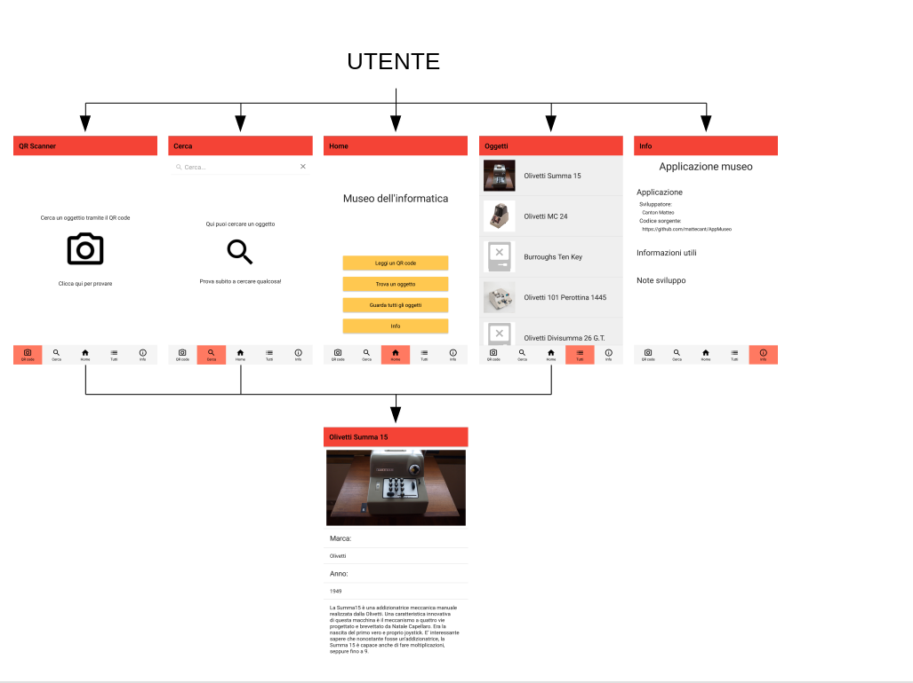
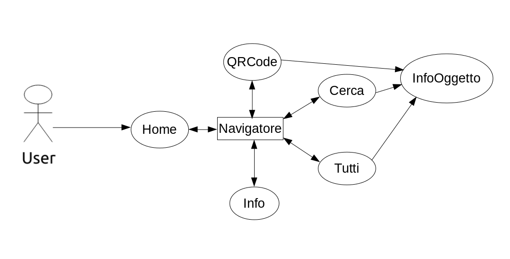

# Android App Development
# Technical Specification
### Matteo Canton, 09/01/2021 - 05/02/2021
## Abstract
Questa applicazione svolge la funzione di informare i visitatori del museo dell'informatica di visionare le informazioni sugli oggetti presenti. La ricerca degli oggetti può essere fatta in base al nome, o tramite lo scanner QR code, con le etichette applicate ai singoli oggetti presenti nel museo.

## General Technical Data
- [X] Activity
  - 1 activity principale vista dal manifest, le altre schermate sono caricate tramite il code js
- [ ] Service
  - Nessun servizio
- [ ] Broadcast Reciver
  - Non usati
- [ ] Content Provider
  - Non usati
- [ ] Intent
  - Non presenti in quanto una sola Activity presente
- [ ] Fragment
  - Non usati
- [X] AsyncTask
  - Presenti molteplici task asicnrone, si dividono nelle seguenti categorie
    1. Richieste http: presenti nel file `src/api/museo.js`, servono a fare le richieste al server. Le funzioni in cui sono contenute gli ritornano come Promise
    2. Utilizzo API fotocamera: presenti nel file  `src/api/QRCode.js`, servono a utilizzare le librerie per leggere il QR code e eseguono il  `then()` con il risultato della lettura
    3. Animazioni: servono per gestire le animazioni presenti nel componente `src/components/InfoApp.vue`, servono a rendere più elegante l'applicazione
- [ ] Threads and Handlers
  - L'applicazione non utilizza il mutithread, la gestione parallela viene gestita tramite  `Promise`
- [ ] SQLite database engine
  - Non usato
- [X] External DBMS connection
  - Utilizzato tramite REST API
- [X] Internet Connectivity
  - Usata per fare le richieste al sito  che lo gestisce
- [ ] Geo-location
  - Non usata
- [ ] Localization
  - Italia
- [ ] Multiple device layout and resolution support
  - In previsione supporto per dispositivi iOS, teoricamente funzionante ma non ancora testata
- [X] Hardware features
  - Uso Fotocamera
- [ ] Google Mobile Services
  - Non usata
- [X] Web application/web service interaction
  - Utilizzo di un server in `NodeJS` per la gestione degli oggetti nel museo e per la ricerca (guardare parte dedicata)
- [X] Third party libraries  
  - Innumerevoli, le radici dell'albero delle dipendenze sono presenti nel file `package.json`, l'elenco completo è ottenibile tramite il comando `npm list`
- [X] Other embedded or involved technologies
  - Lettore di QR Code
- [X] Other
  - Elementi specifici del linguaggio:
    - Componenti
      1. `App.vue`: pagina principale, contiene il navigator
      2. `Cerca.vue`: componente che contiene una barra di ricerca e un `ListaOggetti`
      3. `Home.vue`: presenta 4 pulsnti direzionali e il nome dell'applicazione
      4. `InfoOggetto.vue`: pagina che contine le infomrazioni dettagliate su un signolo oggetto
      5. `InformazioniApp.vue`: contiene informazioni sull'applicazione
      6. `ListaOggetti.vue`: lista degli oggetti, carica un insieme in maniera dinamica di `ListaOggettiOggetto.vue`
      7. `ListaOggettiOggetto.vue`: singolo elemento della lista
      8. `Navigatore.vue`: contiene la barra sotto e tutti gli oggetti; permette di muoversi tra le schermate
      9. `QRScan.vue`: schermata che permette l'accesso al lettore del QR code
    - Routers
      - Sono definizioni di iterazioni, vanno a sostituire gli intent come oggetti globali. Le rotte presenti nell'applicazione sono nel file `src/routers.js`, dove viene indicato con un nome l'oggetto da aprire per un determinato percorso ipotetico. Le rotte presenti sono le seguenti:
      1. `/principale`: porta all'oggetto HomePage (componente `Home`)
      2. `/info`: porta all'oggetto che descrive l'oggetto del museo (componente `InfoOggetto`)
## Key Features
Le funzioni principali dell'applicazione sono le seguenti:
- Cercare tra gli oggetti del museo
- Visionare tutti gli oggetti presenti
- Trovare un oggetto tramite un QR code

Questo mix di combinazioni rende l'applicazione adatta a tutti gli utenti, sia esterni al museo che vogliono informarsi sul contenuto, sia ai visitatori, che possono raggiungere le informazioni dell'oggetto che stanno ammirando senza dover digitare nessun tasto, ma solamente inquadrando il QR code. 

L'aspetto è molto classico, con colori tenui e classici, e un menù di scielta della funzione con descrizione di ogni pagina accompagnata da una piccola didascalia. Nella lista degli oggetti presenti, oltre il nome, è presente anche una foto che permette di identificare facilmente di quale oggetto si tratta, attirando l'attenzione.

L'applicazione risulta anche facile da utilizzare perchè dispone di un'interfaccia semplice e familiare, con l'utilizzo di icone standard per indicare le varie parti, così da comprendere subito cosa fa ogni pulsante. L'immediatezza è ciò che rende l'app efficacie, dato che se fosse difficile da utilizzare il visitatore perderebbe attenzione nell'oggetto e la dedicherebbe solamente all'applicazione, cosa che non deve accadere.

## App structure overview
L'applicazione è divisa in due parti principali, una schermata per la scielta dell'oggetto, e una per la visione delle informazioni su questo.
### Scielta dell'oggetto
La scielta dell'oggetto del quale si vuole vedere la descrizione è composta da un menù a pagine situato nella parte inferiore dell'applicazione. Questo menù permette di cambiare tra le 5 pagine presenti in maniera rapida ed efficacie. Le pagine sono le seguenti:
- QR code: Permette la ricerca tramite QR Code
- Cerca: permette la ricerca per nome
- Home: presenta il nome dell'applicazione e dei pulsanti per modificare pagina
- Lista: contiene tutti gli oggetti presenti nel museo
- Info: presenta le informazioni sull'applicazione
Il passaggio tra queste schermate è molto fluido e senza tempi di caricamento, essendo tutte state caricate insieme.
Quando si clicca su un oggetto della lista, della ricerca, o si inquadra un QR code, l'applicazione apre la schermata di descrizione dell'oggetto.
### Descrizione dell'oggetto
Questa pagina è formata da una vista a scorrimento, nella quale si alternano titoli, paragrafi e immagine, secondo quanto scielto dal mantenitore del museo. Questa schermata non presenta particolari funzioni, dato che il suo unico scopo è quello di poter consultare le informazioni sull'oggetto, senza doversi concentrare su altro


### Wireframe

### Use case diagram


## Code fragments
### Request con Axios
Il seguente codice è un esepio delle richeste eseguite per ottentere le informazioni tramite le API create appositamente.
``` javascript
descrizioneOggetto:(codice)=>{
        return new Promise((res,rej)=>{
            axios({
                method: 'get',
                url: `${servername}/descrivi`,
                timeout: 1000,
                params: {
                  id:codice
                }
              }).then((ris)=>{
                if(ris.status==null) rej();
                else
                res(ris.data);
            }).catch((err)=>{
                rej(err);
            })
        })
    },
```
Il codice è una funzione che ritorna una `Promise`, oggetto javascript che permette la gestione del risultato in maniera asincrona. Il parametro di passaggio del costruttore della `Promise` è una funzione che deve chiamare a sua volta una delle due funzioni che ha come parametri; le unzioni in questione sono `res` (resjolve) e `rej` (reject), e vengono chiamate con un numero arbitrario di parametri, in base a ciò che devono restituire. Il corpo della funzione è formato a sua volta da una chiamata alla funzione axios, a suo volta una Promise. Questa funzione viene chiamata con parametri un oggetto che ne descrive il tipo di richiesta da eseguire. Gli attributi della richiesta utilizzati sono `method`, il metodo con cui effettuare la richiesta HTTP (in questo caso GET), `url`, l'indirizzo al quale fare la richiesta, `timeout`, il tempo espresso in millisecondi dopo il quale la richiesta è da considerarsi fallita, e `params`, un oggetto che contiene i parametri da mettere nella richiesta.
Alla promise risultante viene poi spiegato cosa fare in caso di successo o di fallimento dell'azione. Con il metodo `then`, si da come parametro la funzione che viene eseguita se la richiesta ha successo; in questo caso verrà prima controllato che la richiesta abbia uno status (il codice risultante in HTTP), e se questo non esiste chiama il metodo `rej()` della promise, che avvertirà la funzione chiamante dell'insuccesso dell'operazione. In caso contrario eseguirà la chiamata della funzione `res`, con parametro i dati ottenuti dalla richiesta. Con l'utilizzo del `catch` viene invece detto cosa fare in caso di errore, ovvero chiamare la funzione `rej`.

### Info oggetto
```vue
<template>
  <Page>
    <ActionBar :title="isReady?titoloOggetto:'Caricamento in corso'"   />
    <ListView  for="parteDesc in descrizione">
      <v-template>
        <StackLayout>
          <Label 
            v-if="parteDesc.tipo=='titolo'"
            :text="parteDesc.data" 
            class="titolo" 
            textWrap="true" />
          <Image 
            v-if="parteDesc.tipo=='immagine'"
            :src="parteDesc.data" 
            stretch="aspectFill" />
          <Label 
            v-if="parteDesc.tipo=='testo'"
            :text="parteDesc.data" 
            class="testo" 
            textWrap="true" />
          </StackLayout>
      </v-template>
    </ListView>
  </Page>
</template>

<script>

import apiMuseo from '../api/museo';
export default {
    props:{
        numOggetto:{
            type:Number,
            required:true
        }
    },
    data(){
        return {
            descrizione:[],
            isReady:false,
            titoloOggetto:''
        }
    },
    created(){
        apiMuseo.descrizioneOggetto(this.numOggetto).then((ris)=>{
            this.descrizione=ris.info;
            this.titoloOggetto=ris.nome;
            this.isReady=true;
        }).catch(e=>{
            this.titolo="Errore"
            this.descrizione=[{
                    tipo:'titolo',
                    data:'Errore nella ricerca'
            },{
                tipo:'immagine',
                data:"res://outline_error_outline_black_48"
            },{
                tipo:'testo',
                data:"Non è stato possibile trovare l'oggetto cercato, si prega di riprovare più tardi"
            }]
        });  
    },
}
</script>
<style scoped>
//...
.testo{
    font-size: 15;
    padding-left: 10;
    padding-right: 10;
}
//...
</style>
```
Questa seconda parte analizza uno dei componenti presenti nell'applicazione, in particolare quello della descrizione degli oggetti. Prima di partire nel'analis è necesaria una piccola introduzione a come sono formati i componenti Vue. La struttura di base è la seguente:
```vue
<template>
  
</template>
<script>
export default {
}
</script>
<style>
</style>
```
Questa struttura permette di creare moduli, posizionabili in qualunque posizione dell'applicazione, solitamente dento altri componenti.
La descrizione del componente pare nel `<template>`, dove vengono descritte le infromazioni sullo stile, tramite XML; in questo caso, essendo una applicazion nativescript, i tag utilizzati sarano quelli nativi presenti all'interno di Android, come Image, ListView e Label.

La seconda parte è quella in cui è presente il codice javascript che verrà utilizzo, tramite la dichiarazione di un oggetto. L'ogggetto avrà i seguenti attributi:
- `props`: ciò che l'oggetto riceve quando viene creato
- `data`: le variabili locali presenti nel componente
- `created`: la funzione che viene chiamata quando l'oggetto viene creato
È possibile mettere altri attributi, quali `watch`,`mounted` o `methods`, ma in questo componente vengono usati solamene questi.

La terza parte invece cotiene la descrizione dello stile che avrà il componente, tramite CSS.

Il comportamento dell'applicazione quanto viene chiamato questo componete è il seguente:
1. Viene chiamato il metodo created
2. Viene creata la strutttura dal blocco template
3. L'applicazione riceve le informazioni dal server
4. L'applicazione nota l'arrivo delle informazin e aggiorna i dati
Questo processo funziona perchè Vue è un linguaggio reattivo, ovvero al cambiamento di una variabile, chi la utilizza lo nota e si aggiorna. In questo componente, nella `then` della chiamata della funzione API, viene aggiornata la variabile `isActive`, che permette alla ListView di notare il cambiamento e aggiornare i dati. La ListView viene caricata con il vettore arrivato con i dati dal server, che è un vettore di oggetti; ogni oggetto è formato da un tipo (immagine, testo, titolo) e dal dato. Per ogni componente viene mostrato, in base al tipo, il contenuto con un tag proprio.

###  Nel server
```js
app.get('/infoOggetto',(req,res)=>{
    pool.query(`\
        SELECT nome,img \
        FROM Oggetti \
        WHERE id=?`,
    [
        req.query.id
    ],(err,row,fie)=>{
        console.log(`POST: /infoOggetto \tremote:${req.ip}`)
        if(err){ 
            console.log('error')
            res.status(500).send(err);
            throw err;
        }
        //console.log(row[0]);
        res.send(row[0]);
    })
})
```